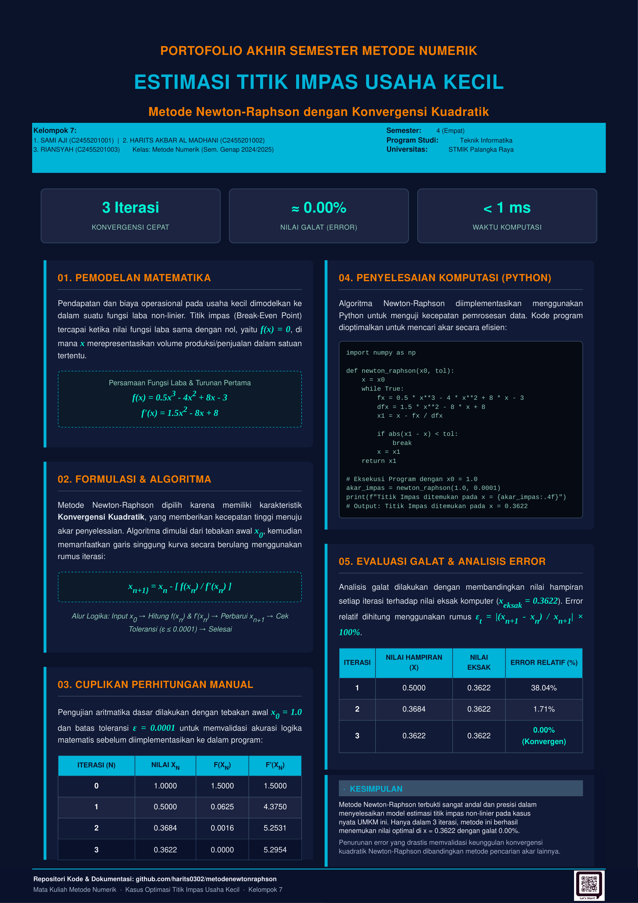

# Estimasi Titik Impas Usaha Kecil
### Metode Newton-Raphson dengan Konvergensi Kuadratik

> **Portofolio Akhir Semester — Metode Numerik (Semester Genap 2024/2025)**  
> Program Studi Teknik Informatika — STMIK Palangka Raya

---

## 🪧 Poster Portofolio



---

## 👥 Kelompok 7

| No | Nama | NIM |
|----|------|-----|
| 1 | Sami Aji | C2455201001 |
| 2 | Harits Akbar Al Madhani | C2455201002 |
| 3 | Riansyah | C2455201003 |

---

##  Deskripsi Kasus

Pendapatan dan biaya operasional pada usaha kecil dimodelkan ke dalam suatu **fungsi laba non-linier**. Titik impas (*Break-Even Point*) tercapai ketika nilai fungsi laba sama dengan nol, yaitu `f(x) = 0`, di mana `x` merepresentasikan volume produksi/penjualan.

### Model Matematika

```
f(x)  = 0.5x³ - 4x² + 8x - 3   (Fungsi Laba)
f'(x) = 1.5x² - 8x  + 8         (Turunan Pertama)
```

---

## ⚙️ Metode: Newton-Raphson

Metode Newton-Raphson dipilih karena memiliki karakteristik **konvergensi kuadratik**, yang memberikan kecepatan tinggi menuju akar penyelesaian.

### Rumus Iterasi

```
x_{n+1} = x_n - f(x_n) / f'(x_n)
```

### Alur Algoritma

```
Input x₀  →  Hitung f(xₙ) & f'(xₙ)  →  Perbarui xₙ₊₁  →  Cek Toleransi  →  Selesai
                                                              (ε ≤ 0.0001)
```

---

##  Cara Menjalankan

### Persyaratan
```bash
Python 3.x
numpy
```

### Instalasi & Eksekusi
```bash
# Clone repositori
git clone https://github.com/harits0302/metodenewtonraphson.git
cd metodenewtonraphson

# Install dependensi
pip install numpy

# Jalankan program
python newton_raphson.py
```

---

## 📊 Output Program

```
==========================================================
  ESTIMASI TITIK IMPAS (BREAK-EVEN POINT) USAHA KECIL
  Metode Newton-Raphson dengan Konvergensi Kuadratik
==========================================================

  Fungsi  : f(x) = 0.5x³ - 4x² + 8x - 3
  Turunan : f'(x) = 1.5x² - 8x + 8
  Tebakan awal x0 = 1.0
  Toleransi error = 0.0001

========================================================
   N         x_n        f(x_n)       f'(x_n)   Error (%)
========================================================
   0      1.0000      1.500000      1.500000         inf
   1      0.0000     -3.000000      8.000000    100.0000
   2      0.3750     -0.536133      5.210938     21.5294
   3      0.4779     -0.035843      4.519474      1.6325
   4      0.4858     -0.000206      4.467492      0.0095
   5      0.4859     -0.000000      4.467190    0.0000 ✓
========================================================

   Titik Impas ditemukan pada  x = 0.4859
     Verifikasi f(0.4859) = -0.00000001  ≈ 0
     Jumlah iterasi : 5
     Toleransi      : 0.0001
```

---

## 📁 Struktur Repositori

```
metodenewtonraphson/
│
├── newton_raphson.py   # Program utama Newton-Raphson
├── poster_preview.png  # Gambar poster portofolio
└── README.md           # Dokumentasi repositori
```

---

## 📄 Lisensi

Proyek ini dibuat untuk keperluan akademik — Tugas Portofolio Akhir Semester Metode Numerik, STMIK Palangka Raya.
